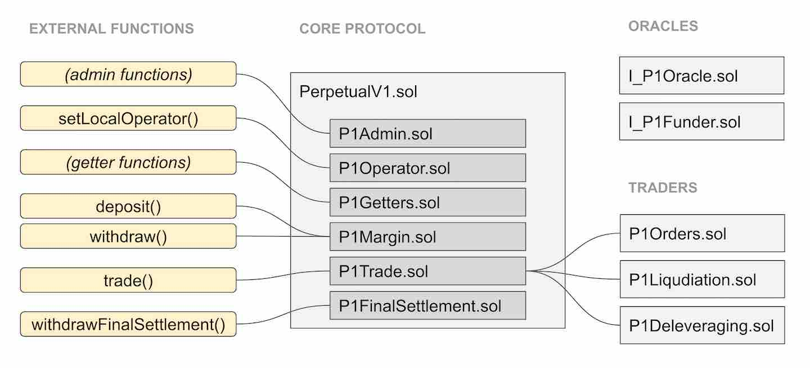

# Perpetual Contracts Protocol

 

The dYdX Perpetual markets are supported by the dYdX Perpetual Contracts protocol, a decentralized protocol running on the Ethereum blockchain. This protocol is distinct from the [Solo](protocol.md) protocol which supports all other trading, borrowing, and lending markets on dYdX.

This article focuses on the decentralized protocol layer of dYdX Perpetuals. A more trader-focused overview can be found in the [Perpetual Guide](perpetual-guide.md).

## Introduction

The dYdX Perpetual Contracts protocol implements a synthetic trading market on Ethereum that allows for exposure to arbitrary liquid assets using ERC-20 tokens as collateral.

Similar to existing perpetual contracts, the price of the contract is tethered to the price of the underlying asset by a dynamic interest rate, called the funding rate. An on-chain price oracle is used for liquidation purposes, and secondarily, to calculate funding payments. The order book for the market can remain off-chain, allowing for faster price movements and better liquidity.

Importantly, the contract’s underlying asset does not have to already exist as a token. For each account trading the perpetual, profits and losses are exchanged using the margin ERC-20 token. This effectively allows users to trade assets that do not actually exist on Ethereum as long as a sufficient price oracle exists. For example a BTC–USDC perpetual contract can exist as long as a BTC–USDC oracle exists. Only USDC would be used as margin deposit for all parties; tokenized BTC is not required.

## Defining a Perpetual Contract

### Global State

Each Perpetual Contract is uniquely defined by:
1. The Margin Token (e.g. USDC)
1. The Margin Requirement (e.g. 7.5%)
1. The Price Oracle Contract
1. The Funding Oracle Contract

The choice of price oracle will determine the underlying asset of the contract (e.g. BTC).

In addition, the Perpetual Contract keeps track of:

1. The Global Index
1. The Unix time of the most recent Global Index update
1. User accounts

The Global Index is used in funding payment calculations and is explained in greater detail later.

### Account State

For a given Perpetual Contract, each Ethereum address has a single account. Each account’s state consists of:

1. The Margin Balance
1. The Position Balance
1. The Cached Index

The Margin Balance and Position Balance are each signed integer values. The Margin Balance is denominated in Margin Token (e.g. USDC). The Position Balance is denominated in the underlying asset (e.g. BTC), that is traded against the Margin Token. The Margin Balance may change due to funding payments, deposits, and withdrawals. Both the Margin Balance and the Position Balance may change due to trades.

The Cached Index of an account is equal to the Global Index at the last time that the account was interacted with. The Cached Index is used when settling funding payments for an account.

### Margin Requirement

The margin requirement is the minimum margin percentage that an account must maintain to avoid liquidation. The margin percentage is defined as the value of any positive balances divided by the value of any negative balances, minus 100%. For example, if 1 BTC is worth 1000 USDC according to the price oracle, then an account with a Position Balance of -1 BTC and a Margin Balance of +1100 USDC would have a margin percentage of 10%.

After each interaction with the Perpetual (except deposits), the smart contract checks the margin percentage of each affected account. If the margin requirement is not met for an account, then the account’s margin percentage must have increased and its position balance must have decreased in absolute size and not changed signs during the interaction. This condition must be met for each affected account, otherwise the transaction is reverted.

### Funding Payments

The Perpetual aims to trade as close to the price of the underlying asset as possible. This helps traders and market-makers understand and predict the price, maintain expectations for how it will perform, and hedge their positions appropriately.

Like other perpetual contracts, we use a “funding rate” to incentivize traders to take the “unpopular” market position and help tether the price of the Perpetual. The funding rate operates similarly to a dynamic interest rate on traders’ positions, paid by longs and received by shorts, or vice-versa, depending on market conditions.

Funding payments are made continuously and are effectuated via updates to the Global Index. The Global Index is a signed number that starts at zero. It is updated at the start of any transaction to the smart contract according to the formula:

  <pre>I = I + T × R × P</pre>

Where **I** is the Global Index, **T** is the time since the last index update, **R** is the current funding rate, and **P** is the current price of the underlying relative to the margin token, according to the price oracle.

The funding rate can be positive (longs pay shorts) or negative (shorts pay longs), thus the Global Index can both increase and decrease. The funding rate is determined by the funding oracle. This contract is fed updates by an Admin address according to an off-chain algorithm that aims to keep the market value of the Perpetual as close as possible to the underlying asset. The funding rate will be positive if the Perpetual is trading higher than the price of the underlying, and negative if the Perpetual is trading lower. Limits on the maximum value and the rate of change of the funding rate are implemented on the funding oracle contract itself.

Each account’s funding payments are derived from changes in the Global Index, scaled by the size of the account’s Position Balance (irrespective of leverage). Any time the Global Index is updated, each account involved in the transaction will settle its funding payments since its last update. This is done by updating the Margin Balance of the account according to the formula:

  <pre>M = M − (I1 − I0) × P</pre>

Where **M** is the Margin Balance of the account, **I1** is the newly updated Global Index, **I0** is the account’s Cached Index, and **P** is the Position Balance of the account. Note that all of these variables are signed numbers which can be positive or negative. After this settlement occurs, the account’s Cached Index is set to the new Global Index. These calculations result in continuous, non-compounding, peer-to-peer interest payments between traders.

## Interacting with the Protocol

  
   
  <em>Simplified overview of the protocol structure.</em>

### Overview

Users interact with the smart contract by calling one of three functions:
1. Deposit
1. Withdraw
1. Trade

The structure of each function is as follows:
1. The Global Index is updated.
1. Funding payments of affected accounts are settled and Cached Indexes are updated.
1. The action (Deposit/Withdraw/Trade) is processed.
1. The margin percentage of each affected account is checked.

We describe each function in more detail below.

### Deposit

This function increases an account’s Margin Balance by transferring in some amount of Margin Token from the caller’s ERC-20 balance.

### Withdraw

This function decreases an account’s Margin Balance by transferring out some amount of Margin Token. The function takes as an argument a destination address to receive the tokens. Withdrawals cannot be completed if the account’s margin percentage is below the margin requirement.

### Trade

A trade happens between two accounts, affecting the Margin and Position balances of those two accounts. The term “trade” is used broadly here to refer to any operation involving a transfer of balances, and the exact types of trades allowed will depend on the Trader contracts in use (described below).

Since a trade is the only way to change the Position Balance of an account, and is always executed as a transfer between two parties, the total net Position Balances across all accounts in a given Perpetual market will, at any time, sum to zero.

Trades are sent to external “Trader” smart contracts for processing and approval. These Trader contracts must be approved by the Perpetual Admin before they can be used. Arguments to the trade function include the address of the Trader contract to use, maker and taker addresses, and additional data depending on the Trader contract. If the trade is approved, the Trader will return an amount of Margin and Position to transfer between the two accounts. The transfer is then executed by the Perpetual contract.

Multiple trades may be processed at once as an atomic batch. The margin percentages of accounts are checked at the end of a batch of trades.

## Trader Contracts

Below, we outline the three Trader Contracts that will be available at the launch of the protocol. Our architecture aims to keep trader logic outside of the core Perpetual smart contract, allowing us to cleanly make changes and upgrades to trade functionality by approving new Trader contracts.

### Orders

The Orders contract is a Trader that allows a taker to execute a trade with a maker, given a signed order from the maker. This allows traders to place orders by signing an order object off-chain. An order matching service (e.g. dYdX) can then match and execute trades on-chain by acting as the “taker” for each order.

Makers can cancel orders, either via an off-chain signature (which must then be relayed on chain), or by calling the cancel function directly on the Orders smart contract.

Note that since no tokens are actually transferred during trades (only Margin and Position Balances), liquidity for trades is exclusive to the Perpetual and cannot be sourced from other DEXes.

### Liquidation

If an account’s margin percentage falls below the Perpetual’s margin requirement, then the account may be liquidated. This process allows the liquidator to assume the margin and position balances (wholly or in-part) of the liquidated account. This transfer of balances occurs at the exact ratio of balances in the liquidated account, therefore, the margin percentage of the liquidated account does not change during liquidation.

Any account may choose to act as a liquidator. If there exists enough liquidity in the market, this action is beneficial to the liquidator since the liquidated account has positive market-value.

### Deleveraging

If the oracle price changes rapidly, the value of some accounts may drop below zero before there is a chance to liquidate them at a profit. In such cases, deleveraging is used to maintain the solvency of the system.

An account with negative net value (i.e. a negative margin percentage) is said to be underwater, and may be targeted for deleveraging. The process is similar to liquidation, in that the balances of the target account are taken on by another account, in this case called the offsetting account. Unlike liquidation, the deleveraging operation allows the caller to specify any account as the offsetting account, as long as it has a position opposite the target (short vs. long) and of greater or equal size.

The Perpetual Admin is responsible for triggering deleveraging whenever an account is underwater. The Admin will use an “insurance fund” as the offsetting account, if available. Otherwise, the Admin will determine the offsetting account via an off-chain algorithm that prioritizes accounts with a high amount of profit and leverage.

If, due to unforeseen circumstances, the Perpetual Admin is offline for a period of time, then any third-party may trigger deleveraging to maintain the solvency of the system. Third-parties are required to mark underwater accounts and wait a time lock in advance of deleveraging, ensuring that the Admin has priority in executing deleveraging.

## Final Settlement

Final settlement is a one-way operation which locks in the current oracle price and Global Index, and restricts all operations except for a special withdrawal function allowing users to exit their positions at the locked price.

Final settlement may be triggered by the Perpetual Admin at the end-of-life of a given Perpetual smart contract. It may also be triggered in the event that a critical vulnerability is discovered that is deemed to pose a significant risk to user funds.
